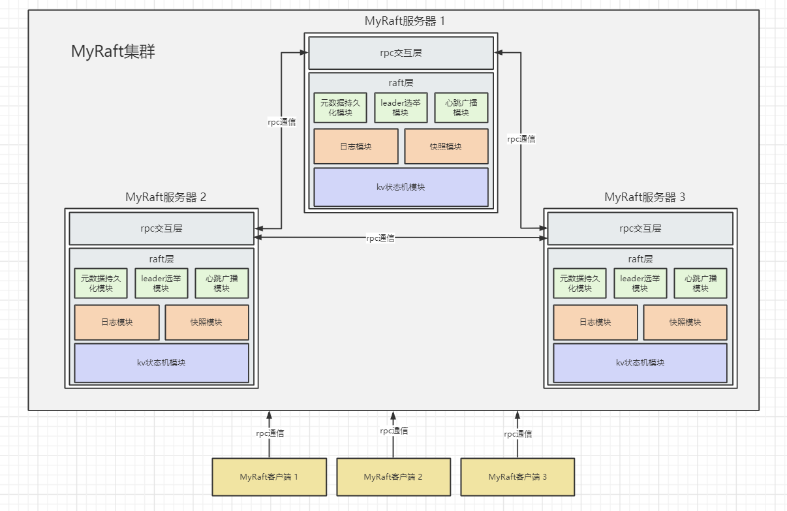
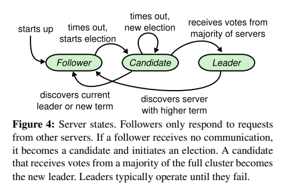
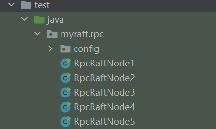

# 手写raft(一) 实现leader选举
## 1. 一致性算法介绍
### 1.1 一致性同步与Paxos算法
* 对可靠性有很高要求的系统，通常都会额外部署1至多个机器为备用副本组成主备集群，避免出现单点故障。  
  有状态的系统需要主节点与备用副本间以某种方式进行数据复制，这样主节点出现故障时就能快速的令备用机器接管系统以达到高可用的目的。
* 常见的主备复制方式是异步、弱一致性的，例如DNS系统，mysql、redis(7.0之前)等数据库的主备复制，或者通过某种消息中间件来进行解耦，即在CAP中选择了AP(高可用、分区容错)而舍弃了C(强一致性)。  
  弱一致性的AP相比强一致CP的复制有着许多优点：**效率高**(多个单次操作可以批量处理)，**耦合性低**(备份节点挂了也不影响主节点工作)，实现相对简单等等。  
  但AP复制最大的缺点就是**丧失了强一致性**，主节点在操作完成响应客户端后，但还未成功同步到备份节点前宕机，对应的变更存在着丢失的风险，因此AP的方案不适用于对一致性有苛刻要求的场合。
* 最原始的强一致性主备同步，即主节点在每一个备份节点同步完成后才能响应客户端成功的方案效率太低，可用性太差(任意一个备份节点故障就会使得集群不可用)。  
  因此基于多数派的分布式强一致算法被发明了出来，其中最早被提出的便是**Paxos**算法。但Paxos算法过于复杂，在分布式环境下有大量的case需要得到正确的实现，因此时至今日也没有多少系统真正的将Paxos落地。  
### 1.2 raft算法
* 由于Paxos过于复杂的原因，Raft算法被发明了出来。Raft算法在设计时大量参考了Paxos，也是一个基于日志和多数派的一致性算法，但在很多细节上相比Paxos做了许多简化。 
* 因为Raft比Paxos要简单很多，更容易被开发人员理解并最终用于构建实际的系统。因此即使raft算法的性能相比Paxos要差一点，但目前流行的强一致分布式系统基本都是基于Raft算法的。  
#####
[raft的论文](https://raft.github.io/raft.pdf) 中将raft算法的功能分解为4个模块：
1. leader选举
2. 日志复制
3. 日志压缩
4. 集群成员动态变更
#####
其中前两项“leader选举”和“日志复制”是raft算法的基础，而后两项“日志压缩”和“集群成员动态变更”属于raft算法在功能上的重要优化。
#####
[raft论文中英翻译](https://www.cnblogs.com/xiaoxiongcanguan/p/17552027.html)
## 2. 自己动手实现一个基于Raft的简易KV数据库
通过raft的论文或者其它相关资料，读者基本能大致理解raft的工作原理。  
但纸上得来终觉浅，绝知此事要躬行，亲手实践才能更好的把握raft中的精巧细节，加深对raft算法的理解，更有效的阅读基于raft或其它一致性协议的开源项目源码。
### MyRaft介绍
在这个系列博客中会带领读者一步步实现一个基于raft算法的简易KV数据库,即MyRaft。MyRaft的实现基于原始的raft算法，没有额外的优化，目的是为了保证实现的简单性。   
MyRaft实现了raft论文中提到的三个功能，即”leader选举“、”日志复制“和”日志压缩“（在实践中发现“集群成员动态变更”对原有逻辑有较大改动而大幅增加了复杂度，限于个人水平暂不实现）。  
三个功能会通过三次迭代实验逐步完成，其中每个迭代都会以博客的形式分享出来。  
##### MyRaft架构图


## 3. MyRaft基础结构源码分析
* 由于是MyRaft的第一个迭代，在这个迭代中需要先搭好MyRaft的基础骨架。  
  raft中的每个节点本质上是一个rpc服务器，同时也是一个rpc的消费者，节点之间通过rpc的方式互相通信。  
* MyRaft使用的rpc框架是上一个实验中自己实现的MyRpc框架：  
  博客地址: https://www.cnblogs.com/xiaoxiongcanguan/p/17506728.html  
  github地址：https://github.com/1399852153/MyRpc (main分支)  
##### Raft的rpc接口定义
* **因为lab1中只实现leader选举，简单起见只定义当前所需的api接口，接口参数相比最终的实现也省去了大量当前用不上的字段，后续有需要再进行拓展。**
```java
public interface RaftService {

    /**
     * 请求投票 requestVote
     *
     * Receiver implementation:
     * 1. Reply false if term < currentTerm (§5.1)
     * 2. If votedFor is null or candidateId, and candidate’s log is at
     * least as up-to-date as receiver’s log, grant vote (§5.2, §5.4)
     *
     * 接受者需要实现以下功能：
     * 1. 如果参数中的任期值term小于当前自己的任期值currentTerm，则返回false不同意投票给调用者
     * 2. 如果自己还没有投票(FIFO)或者已经投票给了candidateId对应的节点(幂等)，
     *    并且候选人的日志至少与被调用者的日志一样新(比较日志的任期值和索引值)，则投票给调用者(返回值里voteGranted为true)
     * */
    RequestVoteRpcResult requestVote(RequestVoteRpcParam requestVoteRpcParam);

    /**
     * 追加日志条目 AppendEntries
     * */
    AppendEntriesRpcResult appendEntries(AppendEntriesRpcParam appendEntriesRpcParam);
}
```
```java
/**
 * 请求投票的RPC接口参数对象
 */
public class RequestVoteRpcParam implements Serializable {

    /**
     * 候选人的任期编号
     * */
    private int term;

    /**
     * 候选人的Id
     * */
    private String candidateId;

    /**
     * 候选人最新日志的索引编号
     * */
    private long lastLogIndex;

    /**
     * 候选人最新日志对应的任期编号
     * */
    private int lastLogTerm;
}
```
```java
/**
 * 请求投票的RPC接口响应对象
 * */
public class RequestVoteRpcResult implements Serializable {

    /**
     * 被调用者当前的任期值
     * */
    private int term;

    /**
     * 是否同意投票给调用者
     * */
    private boolean voteGranted;
}
```
```java
/**
 * 追加日志条目的RPC接口参数对象
 * */
public class AppendEntriesRpcParam implements Serializable {

    /**
     * 当前leader的任期值
     * */
    private int term;

    /**
     * leader的id
     * */
    private String leaderId;
}
```
```java
/**
 * 追加日志条目的RPC接口响应对象
 * */
public class AppendEntriesRpcResult implements Serializable {

    /**
     * 被调用者当前的任期值
     * */
    private int term;

    /**
     * 是否处理成功
     * */
    private boolean success;
}
```
##### MyRaft的Rpc客户端与服务端实现
```java
/**
 * raft的rpc服务
 * */
public class RaftRpcServer extends RaftServer {

    private final Registry registry;
    private final RaftNodeConfig currentNodeConfig;

    public RaftRpcServer(RaftConfig raftConfig, Registry registry){
        super(raftConfig);

        this.currentNodeConfig = raftConfig.getCurrentNodeConfig();
        this.registry = registry;
    }

    @Override
    public void init(List<RaftService> otherNodeInCluster) {
        // 先初始化内部模块
        super.init(otherNodeInCluster);

        // 初始化内部的模块后，启动rpc
        initRpcServer();
    }

    public List<RaftService> getRpcProxyList(List<RaftNodeConfig> otherNodeInCluster){
        return initRpcConsumer(otherNodeInCluster);
    }

    private List<RaftService> initRpcConsumer(List<RaftNodeConfig> otherNodeInCluster){
        ConsumerBootstrap consumerBootstrap = new ConsumerBootstrap()
            .registry(registry)
            .loadBalance(new SimpleRoundRobinBalance());

        // 注册消费者
        Consumer<RaftService> consumer = consumerBootstrap.registerConsumer(RaftService.class,new FastFailInvoker());
        RaftService raftServiceProxy = consumer.getProxy();

        List<RaftService> raftRpcConsumerList = new ArrayList<>();
        for(RaftNodeConfig raftNodeConfig : otherNodeInCluster){
            // 使用rpc代理的客户端
            raftRpcConsumerList.add(new RaftRpcConsumer(raftNodeConfig,raftServiceProxy));
        }

        return raftRpcConsumerList;
    }

    private void initRpcServer(){
        URLAddress providerURLAddress = new URLAddress(currentNodeConfig.getIp(),currentNodeConfig.getPort());
        Provider<RaftService> provider = new Provider<>();
        provider.setInterfaceClass(RaftService.class);
        provider.setRef(this);
        provider.setUrlAddress(providerURLAddress);
        provider.setRegistry(registry);
        provider.export();

        NettyServer nettyServer = new NettyServer(providerURLAddress);
        nettyServer.init();
    }
}
```
```java
public class RaftRpcConsumer implements RaftService {

    private static final Logger logger = LoggerFactory.getLogger(RaftRpcConsumer.class);

    private final RaftNodeConfig targetNodeConfig;
    private final RaftService raftServiceProxy;

    public RaftRpcConsumer(RaftNodeConfig targetNodeConfig, RaftService proxyRaftService) {
        this.targetNodeConfig = targetNodeConfig;
        this.raftServiceProxy = proxyRaftService;
    }

    @Override
    public RequestVoteRpcResult requestVote(RequestVoteRpcParam requestVoteRpcParam) {
        // 强制指定rpc目标的ip/port
        setTargetProviderUrl();
        RequestVoteRpcResult result = raftServiceProxy.requestVote(requestVoteRpcParam);
        return result;
    }

    @Override
    public AppendEntriesRpcResult appendEntries(AppendEntriesRpcParam appendEntriesRpcParam) {
        // 强制指定rpc目标的ip/port
        setTargetProviderUrl();
        AppendEntriesRpcResult result = raftServiceProxy.appendEntries(appendEntriesRpcParam);
        return result;
    }

    private void setTargetProviderUrl(){
        ConsumerRpcContext consumerRpcContext = ConsumerRpcContextHolder.getConsumerRpcContext();
        consumerRpcContext.setTargetProviderAddress(
            new URLAddress(targetNodeConfig.getIp(),targetNodeConfig.getPort()));
    }
}
```
##### raft服务元数据持久化
* raft的论文中提到raft服务中需要持久化的三个要素：currentTerm（当前服务器的任期值）、votedFor(当前服务器在此之前投票给了谁)和logs(raft的操作日志，与本篇博客无关在lab2中才会引入)。  
* currentTerm和votedFor需要持久化的原因是为了避免raft节点在完成leader选举的投票后宕机，重启恢复后如果这两个数据丢失了就很容易在同一任期内投票给多个候选人而出现集群脑裂(即多个合法leader)。
* MyRaft用磁盘文件进行持久化，简单起见在currentTerm或votedFor更新时加写锁，通过原子性的整体刷盘来完成持久化。
#####
```java
public class RaftServerMetaData {

    /**
     * 当前服务器的任期值
     * */
    private int currentTerm;

    /**
     * 当前服务器在此之前投票给了谁？
     * (候选者的serverId，如果还没有投递就是null)
     * */
    private String votedFor;
}
```
```java
public class RaftServerMetaDataPersistentModule {

    /**
     * 当前服务器的任期值
     * */
    private volatile int currentTerm;

    /**
     * 当前服务器在此之前投票给了谁？
     * (候选者的serverId，如果还没有投递就是null)
     * */
    private volatile String votedFor;

    private final File persistenceFile;

    private final ReentrantReadWriteLock reentrantLock = new ReentrantReadWriteLock();
    private final ReentrantReadWriteLock.WriteLock writeLock = reentrantLock.writeLock();
    private final ReentrantReadWriteLock.ReadLock readLock = reentrantLock.readLock();

    public RaftServerMetaDataPersistentModule(String serverId) {
        String userPath = System.getProperty("user.dir") + File.separator + serverId;

        this.persistenceFile = new File(userPath + File.separator + "raftServerMetaData-" + serverId + ".txt");
        MyRaftFileUtil.createFile(persistenceFile);

        // 读取持久化在磁盘中的数据
        RaftServerMetaData raftServerMetaData = readRaftServerMetaData(persistenceFile);
        this.currentTerm = raftServerMetaData.getCurrentTerm();
        this.votedFor = raftServerMetaData.getVotedFor();
    }

    public int getCurrentTerm() {
        readLock.lock();
        try {
            return currentTerm;
        }finally {
            readLock.unlock();
        }
    }

    public void setCurrentTerm(int currentTerm) {
        writeLock.lock();
        try {
            this.currentTerm = currentTerm;

            // 更新后数据落盘
            persistentRaftServerMetaData(new RaftServerMetaData(this.currentTerm,this.votedFor),persistenceFile);
        }finally {
            writeLock.unlock();
        }
    }

    public String getVotedFor() {
        readLock.lock();
        try {
            return votedFor;
        }finally {
            readLock.unlock();
        }
    }

    public void setVotedFor(String votedFor) {
        writeLock.lock();
        try {
            if(Objects.equals(this.votedFor,votedFor)){
                // 相等的话就不刷新了
                return;
            }
            
            this.votedFor = votedFor;

            // 更新后数据落盘
            persistentRaftServerMetaData(new RaftServerMetaData(this.currentTerm,this.votedFor),persistenceFile);
        }finally {
            writeLock.unlock();
        }
    }

    private static RaftServerMetaData readRaftServerMetaData(File persistenceFile){
        String content = MyRaftFileUtil.getFileContent(persistenceFile);
        if(StringUtils.hasText(content)){
            return JsonUtil.json2Obj(content,RaftServerMetaData.class);
        }else{
            return RaftServerMetaData.getDefault();
        }
    }

    private static void persistentRaftServerMetaData(RaftServerMetaData raftServerMetaData, File persistenceFile){
        String content = JsonUtil.obj2Str(raftServerMetaData);

        MyRaftFileUtil.writeInFile(persistenceFile,content);
    }
}
```
## 3. leader选举原理与MyRaft实现解析
### leader选举原理
raft的leader选举在论文中有较详细的描述，这里说一下我认为的关键细节。
* Raft算法中leader扮演着绝对核心的角色，leader负责处理客户端的请求、将操作日志同步给其它的follower节点以及通知follower提交日志等等。  
  因此Raft集群必须基于多数原则选举出一个存活的leader才能对外提供服务，并且一个任期内只能有一个基于多数票选出的leader。
* raft是非拜占庭容错共识算法，rpc通信时交互的双方的请求和响应都是可信的，不会作假，节点运行的行为也符合raft算法的规定。
* raft中存在任期term的概念，任期值只会单向递增，可以理解为一个虚拟的时间，是raft实现线性一致性关键的一环。过去的leader(term值更小的)需要服从、追随现任的leader(term值更大的)。
* 在raft节点刚启动时处于follower追随者状态。如果一段时间内raft节点没有接受到来自leader的定时心跳rpc(logEntry为空的appendEntries)通知时就会发起一轮新的选举。  
  产生这个现象的原因有很多，比如集群刚刚启动还没有leader；或者之前的leader因为某种原因宕机或与follower的网络通信出现故障等。
* 发起请求的follower会转变为candidate候选人状态，并首先投票给自己。同时并行的向集群中的其它节点发起请求投票的rpc请求(requestVote),可以理解为给自己拉票。  
  接收到requestVote请求的节点会根据自身的状态等信息决定是否投票给发起投票的节点。  
  当candidate获得了集群中超过半数的投票(即包括自己在内的1票加上requestVote返回投票成功的数量超过半数(比如5节点得到3票，6节点得到4票))，则candidate成为当前任期的leader。  
  如果没有任何一个candidate获得多数选票(没选出leader，可能是分票了，也可能是网络波动等等)，则candidate会将当前任期自增1，则下一次选举超时时会再触发一轮新的选举，循环往复直至选出leader。
#####

#####
* leader当选后需要立即向其它的节点发送心跳rpc(logEntry为空的appendEntries)，昭告新leader的产生以抑制其它节点发起新的选举。  
  心跳rpc必须以一定频率的定时向所有follower发送，发送的时间间隔需要小于设置的选举超时时间。
* 由于处理requestVote是先到先得的，同一任期内先发起投票请求的candidate会收到票，后发送的会被拒绝。  
  假如leader宕机了，则每个follower都会在一段时间后触发新一轮选举，如果没有额外的限制，则每个节点并发的发起选举很容易导致分票，即自己投给自己，则难以达成共识(取得多数票)。  
  Raft的论文中提出了随机化选举超时时间的方案，即每个follower节点的选举超时时间是一个固定值再加上一个随机化的值得到的，这样很难在同一瞬间都触发选举。  
  随机超时时间更短的follower能够最先发起选举，更快的得到其它节点的投票从而避免分票的情况。  
  虽然无法完全避免分票，但实践中发现效果很好，随机超时时间下通常少数的几次分票后就能收敛而选出leader来。
* 注意：raft论文在5.4安全性一节中提到，leader选举对于candidate的日志状态有一定的要求(因为只有拥有完整日志的节点才有资格成为leader，确保leader更替时日志不会丢失)，
  但lab1中不支持日志复制，所以MyRaft在lab1的requestVote实现中省略了相关逻辑。

### MyRaft leader选举源码分析
下面基于源码展开介绍MyRaft是如何实现raft领导者选举的。
#####
大致分为以下几部分：
1. raft节点配置
2. raft节点定时选举超时检查
3. candidate发起选举
4. leader定时发起心跳广播
5. raft节点处理requestVote请求
#### 3.1 raft节点配置
* raft服务中有很多参数需要配置，比如服务的ip/port，或者raft相关的选举超时时间、心跳间隔时间等等。  
* MyRaft中统一放到一个叫RaftConfig的类里维护，后续的功能实现时也会在这个类中进行拓展。
#####
```java
public class RaftConfig {
    
    /**
     * 当前服务节点的id(集群内全局唯一)
     * */
    private final String serverId;

    /**
     * 自己节点的配置
     * */
    private final RaftNodeConfig currentNodeConfig;

    /**
     * 整个集群所有的服务节点的id集合
     * */
    private final List<RaftNodeConfig> raftNodeConfigList;

    /**
     * 集群中多数的值(例如：5节点majorityNum=3,6节点majorityNum=4)
     * */
    private final int majorityNum;

    /**
     * 选举超时时间 单位:秒
     * */
    private int electionTimeout;
    
    /**
     * 选举超时时间的随机化区间 单位：毫秒
     * */
    private Range<Integer> electionTimeoutRandomRange;

    /**
     * 心跳间隔时间 单位：秒
     * */
    private int HeartbeatInternal;
}
```
```java
public class RaftNodeConfig {

    private String serverId;
    private String ip;
    private int port;
}
```
#### 3.2 raft节点定时选举超时检查
* MyRaft中将leader选举相关的主要逻辑都集中维护在RaftLeaderElectionModule类中。  
  lastHeartbeatTime属性用于存储最后一次收到leader心跳的绝对时间，如果当前节点状态不是leader，并且发现lastHeartbeatTime距离当前时间已经超过了指定的选举超时时间则触发选举。
* 心跳检查的超时逻辑集中在HeartbeatTimeoutCheckTask中。  
  由于需要引入随机化的心跳超时时间，因此无法使用ScheduledExecutorService的scheduleAtFixedRate方法，改为在每个任务执行完成时再添加一个新任务回去的方式来实现。
#####
```java
/**
 * Raft服务器的leader选举模块
 * */
public class RaftLeaderElectionModule {

    private static final Logger logger = LoggerFactory.getLogger(RaftLeaderElectionModule.class);

    private final RaftServer currentServer;

    /**
     * 最近一次接受到心跳的时间
     * */
    private volatile Date lastHeartbeatTime;

    private final ScheduledExecutorService scheduledExecutorService;

    private final ExecutorService rpcThreadPool;

    public RaftLeaderElectionModule(RaftServer currentServer) {
        this.currentServer = currentServer;
        this.lastHeartbeatTime = new Date();
        this.scheduledExecutorService = Executors.newScheduledThreadPool(3);
        this.rpcThreadPool = Executors.newFixedThreadPool(
                Math.max(currentServer.getOtherNodeInCluster().size() * 2, 1));

        registerHeartbeatTimeoutCheckTaskWithRandomTimeout();
    }

    /**
     * 提交新的延迟任务(带有随机化的超时时间)
     * */
    public void registerHeartbeatTimeoutCheckTaskWithRandomTimeout(){
        int electionTimeout = currentServer.getRaftConfig().getElectionTimeout();
        if(currentServer.getCurrentTerm() > 0 && currentServer.getRaftConfig().getDebugElectionTimeout() != null){
            // debug的时候多等待一些时间
            electionTimeout = currentServer.getRaftConfig().getDebugElectionTimeout();
        }

        long randomElectionTimeout = getRandomElectionTimeout();
        // 选举超时时间的基础上，加上一个随机化的时间
        long delayTime = randomElectionTimeout + electionTimeout * 1000L;
        logger.debug("registerHeartbeatTimeoutCheckTaskWithRandomTimeout delayTime={}",delayTime);
        scheduledExecutorService.schedule(
            new HeartbeatTimeoutCheckTask(currentServer,this),delayTime,TimeUnit.MILLISECONDS);
    }

    /**
     * 处理投票请求
     * 注意：synchronized修饰防止不同candidate并发的投票申请处理，以FIFO的方式处理
     * */
    public synchronized RequestVoteRpcResult requestVoteProcess(RequestVoteRpcParam requestVoteRpcParam){
        if(this.currentServer.getCurrentTerm() > requestVoteRpcParam.getTerm()){
            // Reply false if term < currentTerm (§5.1)
            // 发起投票的candidate任期小于当前服务器任期，拒绝投票给它
            logger.info("reject requestVoteProcess! term < currentTerm, currentServerId={}",currentServer.getServerId());
            return new RequestVoteRpcResult(this.currentServer.getCurrentTerm(),false);
        }

        // 发起投票的节点任期高于当前节点，无条件投票给它(任期高的说了算)
        if(this.currentServer.getCurrentTerm() < requestVoteRpcParam.getTerm()){
            // 刷新元数据
            this.currentServer.refreshRaftServerMetaData(
                new RaftServerMetaData(requestVoteRpcParam.getTerm(),requestVoteRpcParam.getCandidateId()));
            // 任期没它高，自己转为follower
            this.currentServer.setServerStatusEnum(ServerStatusEnum.FOLLOWER);
            return new RequestVoteRpcResult(this.currentServer.getCurrentTerm(),true);
        }

        // term任期值相同，需要避免同一任期内投票给不同的节点而脑裂
        if(this.currentServer.getVotedFor() != null && !this.currentServer.getVotedFor().equals(requestVoteRpcParam.getCandidateId())){
            // If votedFor is null or candidateId（取反的卫语句）
            // 当前服务器已经把票投给了别人,拒绝投票给发起投票的candidate
            logger.info("reject requestVoteProcess! votedFor={},currentServerId={}",
                currentServer.getVotedFor(),currentServer.getServerId());
            return new RequestVoteRpcResult(this.currentServer.getCurrentTerm(),false);
        }

        // 投票校验通过,刷新元数据
        this.currentServer.refreshRaftServerMetaData(
            new RaftServerMetaData(requestVoteRpcParam.getTerm(),requestVoteRpcParam.getCandidateId()));
        this.currentServer.processCommunicationHigherTerm(requestVoteRpcParam.getTerm());
        return new RequestVoteRpcResult(this.currentServer.getCurrentTerm(),true);
    }

    public void refreshLastHeartbeatTime(){
        // 刷新最新的接受到心跳的时间
        this.lastHeartbeatTime = new Date();
        // 接受新的心跳,说明现在leader是存活的，清理掉之前的投票信息
        this.currentServer.cleanVotedFor();
    }
    
    private long getRandomElectionTimeout(){
        long min = currentServer.getRaftConfig().getElectionTimeoutRandomRange().getLeft();
        long max = currentServer.getRaftConfig().getElectionTimeoutRandomRange().getRight();

        // 生成[min,max]范围内随机整数的通用公式为：n=rand.nextInt(max-min+1)+min。
        return ThreadLocalRandom.current().nextLong(max-min+1) + min;
    }
}
```
```java
/**
 * 心跳超时检查任务
 * */
public class HeartbeatTimeoutCheckTask implements Runnable{

    private static final Logger logger = LoggerFactory.getLogger(HeartbeatTimeoutCheckTask.class);

    private final RaftServer currentServer;
    private final RaftLeaderElectionModule raftLeaderElectionModule;

    public HeartbeatTimeoutCheckTask(RaftServer currentServer, RaftLeaderElectionModule raftLeaderElectionModule) {
        this.currentServer = currentServer;
        this.raftLeaderElectionModule = raftLeaderElectionModule;
    }

    @Override
    public void run() {
        if(currentServer.getServerStatusEnum() == ServerStatusEnum.LEADER){
            // leader是不需要处理心跳超时的
            // 注册下一个心跳检查任务
            raftLeaderElectionModule.registerHeartbeatTimeoutCheckTaskWithRandomTimeout();
        }else{
            try {
                doTask();
            }catch (Exception e){
                logger.info("do HeartbeatTimeoutCheckTask error! ignore",e);
            }

            // 注册下一个心跳检查任务
            raftLeaderElectionModule.registerHeartbeatTimeoutCheckTaskWithRandomTimeout();
        }
    }

    private void doTask(){
        logger.debug("do HeartbeatTimeoutCheck start {}",currentServer.getServerId());

        int electionTimeout = currentServer.getRaftConfig().getElectionTimeout();

        // 当前时间
        Date currentDate = new Date();
        Date lastHeartbeatTime = raftLeaderElectionModule.getLastHeartbeatTime();
        long diffTime = currentDate.getTime() - lastHeartbeatTime.getTime();

        logger.debug("currentDate={}, lastHeartbeatTime={}, diffTime={}, serverId={}",
            currentDate,lastHeartbeatTime,diffTime,currentServer.getServerId());
        // 心跳超时判断
        if(diffTime > (electionTimeout * 1000L)){
            logger.info("HeartbeatTimeoutCheck check fail, trigger new election! serverId={}",currentServer.getServerId());

            // 触发新的一轮选举
            triggerNewElection();
        }else{
            // 认定为心跳正常，无事发生
            logger.debug("HeartbeatTimeoutCheck check success {}",currentServer.getServerId());
        }

        logger.debug("do HeartbeatTimeoutCheck end {}",currentServer.getServerId());
    }

    private void triggerNewElection(){
        logger.info("HeartbeatTimeoutCheck check fail, trigger new election! serverId={}",currentServer.getServerId());

        // 距离最近一次接到心跳已经超过了选举超时时间，触发新一轮选举

        // 当前服务器节点当前任期自增1
        currentServer.setCurrentTerm(currentServer.getCurrentTerm()+1);
        // 自己发起选举，先投票给自己
        currentServer.setVotedFor(currentServer.getServerId());
        // 角色转变为CANDIDATE候选者
        currentServer.setServerStatusEnum(ServerStatusEnum.CANDIDATE);

        // 并行的发送请求投票的rpc给集群中的其它节点
        List<RaftService> otherNodeInCluster = currentServer.getOtherNodeInCluster();
        List<Future<RequestVoteRpcResult>> futureList = new ArrayList<>(otherNodeInCluster.size());

        // 构造请求参数
        RequestVoteRpcParam requestVoteRpcParam = new RequestVoteRpcParam();
        requestVoteRpcParam.setTerm(currentServer.getCurrentTerm());
        requestVoteRpcParam.setCandidateId(currentServer.getServerId());

        for(RaftService node : otherNodeInCluster){
            Future<RequestVoteRpcResult> future = raftLeaderElectionModule.getRpcThreadPool().submit(
                ()-> {
                    RequestVoteRpcResult rpcResult = node.requestVote(requestVoteRpcParam);
                    // 收到更高任期的处理
                    currentServer.processCommunicationHigherTerm(rpcResult.getTerm());
                    return rpcResult;
                }
            );

            futureList.add(future);
        }

        List<RequestVoteRpcResult> requestVoteRpcResultList = CommonUtil.concurrentGetRpcFutureResult(
            "requestVote", futureList,
            raftLeaderElectionModule.getRpcThreadPool(),1,TimeUnit.SECONDS);

        // 获得rpc响应中决定投票给自己的总票数（算上自己的1票）
        int getRpcVoted = (int) requestVoteRpcResultList.stream().filter(RequestVoteRpcResult::isVoteGranted).count()+1;
        logger.info("HeartbeatTimeoutCheck election, getRpcVoted={}, currentServerId={}",getRpcVoted,currentServer.getServerId());

        // 是否获得大多数的投票
        boolean majorVoted = getRpcVoted >= this.currentServer.getRaftConfig().getMajorityNum();
        if(majorVoted){
            logger.info("HeartbeatTimeoutCheck election result: become a leader! {}, currentTerm={}",currentServer.getServerId(),currentServer.getCurrentTerm());

            // 票数过半成功当选为leader
            currentServer.setServerStatusEnum(ServerStatusEnum.LEADER);
            currentServer.setCurrentLeader(currentServer.getServerId());

            // 成为leader后立马发送一次心跳,抑制其它节点发起新的一轮选举
            // Upon election: send initial empty AppendEntries RPCs (heartbeat) to each server;
            // repeat during idle periods to prevent election timeouts (§5.2)
            HeartbeatBroadcastTask.doHeartbeatBroadcast(currentServer);
        }else{
            // 票数不过半，无法成为leader
            logger.info("HeartbeatTimeoutCheck election result: not become a leader! {}",currentServer.getServerId());
        }

        this.currentServer.cleanVotedFor();
    }
}
```
#### 3.3 candidate发起选举
* 在上一节介绍的HeartbeatTimeoutCheckTask中，如果发现有一段时间没有收到心跳后当前节点便会触发新一轮的选举，主要逻辑在triggerNewElection方法中。  
  triggerNewElection中通过首先令当前term值自增1并投票给自己，然后并行的向集群中的其它节点发送requestVote的rpc请求。
* 并行处理逻辑通过CommonUtil中的concurrentGetRpcFutureResult方法收集所有的响应结果。  
  通过future.get设置超时时间，超时则认为是投票失败。
* 在超时时间内获得所有响应结果后，计算所得到的的票数是否大于半数(>majorityNum)。  
  如果超过半数则认为选举成功，自己成为合法的leader。当前节点刷新相关的状态数据，同时立即发起一次心跳广播以抑制其它节点发起新的选举。
#####  
```java
public class CommonUtil {

    private static final Logger logger = LoggerFactory.getLogger(CommonUtil.class);

    /**
     * 并发的获得future列表的结果
     * */
    public static <T> List<T> concurrentGetRpcFutureResult(
            String info, List<Future<T>> futureList, ExecutorService threadPool, long timeout, TimeUnit timeUnit){
        CountDownLatch countDownLatch = new CountDownLatch(futureList.size());

        List<T> resultList = new ArrayList<>(futureList.size());

        for(Future<T> futureItem : futureList){
            threadPool.execute(()->{
                try {
                    logger.debug(info + " concurrentGetRpcFutureResult start!");
                    T result = futureItem.get(timeout,timeUnit);
                    logger.debug(info + " concurrentGetRpcFutureResult end!");

                    resultList.add(result);
                } catch (Exception e) {
                    // rpc异常不考虑
                    logger.error( "{} getFutureResult error!",info,e);
                } finally {
                    countDownLatch.countDown();
                }
            });
        }

        try {
            countDownLatch.await();
        } catch (InterruptedException e) {
            throw new MyRaftException("getFutureResult error!",e);
        }

        return resultList;
    }
}
```
#### 3.4 leader定时发起心跳广播
* MyRaft中将leader心跳广播相关的逻辑都集中在了RaftHeartbeatBroadcastModule类中，心跳广播任务以RaftConfig中设置的频率定期执行。  
  需要注意的是，心跳的时间间隔必须配置为明显小于配置的选举超时时间的值(考虑到rpc网络请求延迟以及follower实际处理心跳的耗时)，否则leader心跳将无法抑制follower触发选举。
* leader心跳广播的逻辑集中在HeartbeatBroadcastTask中。和发起投票类似，当前节点通过future并发的向集群中的所有节点发送logEntry为空的appendEntries(因为lab1中不涉及日志复制，所以直接去掉了logEntry这个参数字段)。  
  leader原则上可以不关心follower对于心跳的响应结果，但还是需要检查成功响应中返回的term值。如果发现有其它节点返回了更大的term值，说明集群中可能已经选出了新的leader或者正在进行选举，则当前节点需要退回到follower状态。
#####
```java
/**
 * Raft服务器的心跳广播模块
 * */
public class RaftHeartbeatBroadcastModule {

    private final RaftServer currentServer;

    private final ScheduledExecutorService scheduledExecutorService;

    private final ExecutorService rpcThreadPool;

    public RaftHeartbeatBroadcastModule(RaftServer currentServer) {
        this.currentServer = currentServer;

        this.scheduledExecutorService = Executors.newScheduledThreadPool(1);
        this.rpcThreadPool = Executors.newFixedThreadPool(
            Math.max(currentServer.getOtherNodeInCluster().size() * 2, 1));

        int HeartbeatInternal = currentServer.getRaftConfig().getHeartbeatInternal();

        // 心跳广播任务需要以固定频率执行(scheduleAtFixedRate)
        scheduledExecutorService.scheduleAtFixedRate(
            new HeartbeatBroadcastTask(currentServer,this), 0, HeartbeatInternal, TimeUnit.SECONDS);
    }
}
```
```java
/**
 * leader心跳广播任务
 * */
public class HeartbeatBroadcastTask implements Runnable{

    private static final Logger logger = LoggerFactory.getLogger(HeartbeatBroadcastTask.class);

    private final RaftServer currentServer;
    private final RaftHeartbeatBroadcastModule raftHeartbeatBroadcastModule;

    private int HeartbeatCount = 0;

    public HeartbeatBroadcastTask(RaftServer currentServer, RaftHeartbeatBroadcastModule raftHeartbeatBroadcastModule) {
        this.currentServer = currentServer;
        this.raftHeartbeatBroadcastModule = raftHeartbeatBroadcastModule;
    }

    @Override
    public void run() {
        if(currentServer.getServerStatusEnum() != ServerStatusEnum.LEADER){
            // 只有leader才需要广播心跳
            return;
        }

        // 心跳广播
        doHeartbeatBroadcast(currentServer);
    }

    /**
     * 做心跳广播
     * @return 是否大多数节点依然认为自己是leader
     * */
    public static boolean doHeartbeatBroadcast(RaftServer currentServer){
        logger.info("do HeartbeatBroadcast start {}",currentServer.getServerId());

        // 先刷新自己的心跳时间
        currentServer.getRaftLeaderElectionModule().refreshLastHeartbeatTime();

        // 并行的发送心跳rpc给集群中的其它节点
        List<RaftService> otherNodeInCluster = currentServer.getOtherNodeInCluster();
        List<Future<AppendEntriesRpcResult>> futureList = new ArrayList<>(otherNodeInCluster.size());

        // 构造请求参数(心跳rpc，entries为空)
        AppendEntriesRpcParam appendEntriesRpcParam = new AppendEntriesRpcParam();
        appendEntriesRpcParam.setTerm(currentServer.getCurrentTerm());
        appendEntriesRpcParam.setLeaderId(currentServer.getServerId());

        for(RaftService node : otherNodeInCluster){
            Future<AppendEntriesRpcResult> future = currentServer.getRaftHeartbeatBroadcastModule().getRpcThreadPool().submit(
                ()-> {
                    AppendEntriesRpcResult rpcResult = node.appendEntries(appendEntriesRpcParam);
                    // rpc交互时任期高于当前节点任期的处理
                    currentServer.processCommunicationHigherTerm(rpcResult.getTerm());
                    return rpcResult;
                }
            );

            futureList.add(future);
        }

        List<AppendEntriesRpcResult> appendEntriesRpcResultList = CommonUtil.concurrentGetRpcFutureResult("doHeartbeatBroadcast",futureList,
            currentServer.getRaftHeartbeatBroadcastModule().getRpcThreadPool(),1, TimeUnit.SECONDS);

        // 通知成功的数量(+1包括自己)
        int successResponseCount = (int) (appendEntriesRpcResultList.stream().filter(AppendEntriesRpcResult::isSuccess).count() + 1);
        if(successResponseCount >= currentServer.getRaftConfig().getMajorityNum()
            && currentServer.getServerStatusEnum() == ServerStatusEnum.LEADER){
            // 大多数节点依然认为自己是leader,并且广播的节点中没有人任期高于当前节点，让当前节点主动让位
            return true;
        }else{
            // 大多数节点不认为自己是leader（包括广播超时等未接到响应的场景，也认为是广播失败）
            return false;
        }
    }
}
```
#### 3.5 raft节点处理requestVote请求和心跳请求
#####
**处理requestVote请求**  
* MyRaft处理requestVote的逻辑在上面提到的RaftLeaderElectionModule的requestVoteProcess方法中。  
  raft需要保证每个任期都只能选出一个leader，所以对于特定的term任期需要做到只有一个节点能获得超过半数选票。
* 因此，requestVoteProcess中会对发起投票的candidate和自己本地的term值进行比对，如果term值比自己低就直接拒绝(过去的leader不是leader，只有现在的leader才是leader)。  
  每个节点只有一票，如果term值相同则需要确保自己在此之前没有投票给其它candidate。
#####
**处理心跳请求**  
* MyRaft的处理心跳请求的逻辑在RaftServer类的appendEntries中。由于lab1没有日志复制的功能，所以认为收到的请求都是心跳请求。  
* appendEntries中，同样需要比对参数中term和本地term的值，**尽可能**的确保是真正的leader发来的心跳。  
  如果校验通过了，则将本地的最后接受到的心跳时间刷新为当前时间，来抑制选举超时检查任务中触发新一轮选举。
#####   
```java
public class RaftServer implements RaftService {

    private static final Logger logger = LoggerFactory.getLogger(RaftServer.class);

    /**
     * 当前服务节点的id(集群内全局唯一)
     * */
    private final String serverId;

    /**
     * Raft服务端配置
     * */
    private final RaftConfig raftConfig;

    /**
     * 当前服务器的状态
     * */
    private volatile ServerStatusEnum serverStatusEnum;

    /**
     * raft服务器元数据(当前任期值currentTerm、当前投票给了谁votedFor)
     * */
    private final RaftServerMetaDataPersistentModule raftServerMetaDataPersistentModule;

    /**
     * 当前服务认为的leader节点的Id
     * */
    private volatile String currentLeader;

    /**
     * 集群中的其它raft节点服务
     * */
    protected List<RaftService> otherNodeInCluster;

    private RaftLeaderElectionModule raftLeaderElectionModule;
    private RaftHeartbeatBroadcastModule raftHeartbeatBroadcastModule;

    public RaftServer(RaftConfig raftConfig) {
        this.serverId = raftConfig.getServerId();
        this.raftConfig = raftConfig;
        // 初始化时都是follower
        this.serverStatusEnum = ServerStatusEnum.FOLLOWER;

        // 服务器元数据模块
        this.raftServerMetaDataPersistentModule = new RaftServerMetaDataPersistentModule(raftConfig.getServerId());
    }

    public void init(List<RaftService> otherNodeInCluster){
        // 集群中的其它节点服务
        this.otherNodeInCluster = otherNodeInCluster;

        raftLeaderElectionModule = new RaftLeaderElectionModule(this);
        raftHeartbeatBroadcastModule = new RaftHeartbeatBroadcastModule(this);

        logger.info("raft server init end! otherNodeInCluster={}, currentServerId={}",otherNodeInCluster,serverId);
    }

    @Override
    public RequestVoteRpcResult requestVote(RequestVoteRpcParam requestVoteRpcParam) {
        RequestVoteRpcResult requestVoteRpcResult = raftLeaderElectionModule.requestVoteProcess(requestVoteRpcParam);

        processCommunicationHigherTerm(requestVoteRpcParam.getTerm());

        logger.info("do requestVote requestVoteRpcParam={},requestVoteRpcResult={}, currentServerId={}",
            requestVoteRpcParam,requestVoteRpcResult,this.serverId);

        return requestVoteRpcResult;
    }

    @Override
    public AppendEntriesRpcResult appendEntries(AppendEntriesRpcParam appendEntriesRpcParam) {
        if(appendEntriesRpcParam.getTerm() < this.raftServerMetaDataPersistentModule.getCurrentTerm()){
            // Reply false if term < currentTerm (§5.1)
            // 拒绝处理任期低于自己的老leader的请求

            logger.info("doAppendEntries term < currentTerm");
            return new AppendEntriesRpcResult(this.raftServerMetaDataPersistentModule.getCurrentTerm(),false);
        }

        if(appendEntriesRpcParam.getTerm() >= this.raftServerMetaDataPersistentModule.getCurrentTerm()){
            // appendEntries请求中任期值如果大于自己，说明已经有一个更新的leader了，自己转为follower，并且以对方更大的任期为准
            this.serverStatusEnum = ServerStatusEnum.FOLLOWER;
            this.currentLeader = appendEntriesRpcParam.getLeaderId();
            this.raftServerMetaDataPersistentModule.setCurrentTerm(appendEntriesRpcParam.getTerm());
        }

        // 来自leader的心跳处理，清理掉之前选举的votedFor
        this.cleanVotedFor();
        // entries为空，说明是心跳请求，刷新一下最近收到心跳的时间
        raftLeaderElectionModule.refreshLastHeartbeatTime();

        // 心跳请求，直接返回
        return new AppendEntriesRpcResult(this.raftServerMetaDataPersistentModule.getCurrentTerm(),true);
    }
}
```
## 4. MyRaft leader选举demo验证
在工程的test目录下，可以启动一个5节点的MyRaft的服务集群(用main方法启动即可)，通过修改其中的RaftClusterGlobalConfig类可以修改相关的配置。

#####
```java
public class RaftClusterGlobalConfig {
    
    public static Registry registry = RegistryFactory.getRegistry(
        new RegistryConfig(RegistryCenterTypeEnum.FAKE_REGISTRY.getCode(), "127.0.0.1:2181"));

    /**
     * raft的集群配置
     * */
    public static final List<RaftNodeConfig> raftNodeConfigList = Arrays.asList(
        new RaftNodeConfig("raft-1","127.0.0.1",8001)
        ,new RaftNodeConfig("raft-2","127.0.0.1",8002)
        ,new RaftNodeConfig("raft-3","127.0.0.1",8003)
        ,new RaftNodeConfig("raft-4","127.0.0.1",8004)
        ,new RaftNodeConfig("raft-5","127.0.0.1",8005)
    );

    public static final int electionTimeout = 3;

    public static final Integer debugElectionTimeout = null;

    public static final int HeartbeatInterval = 1;

    /**
     * N次心跳后，leader会自动模拟出现故障(退回follow，停止心跳广播)
     * N<=0代表不触发自动模拟故障
     */
    public static final int leaderAutoFailCount = 0;

    /**
     * 随机化的选举超时时间(毫秒)
     * */
    public static final Range<Integer> electionTimeoutRandomRange = new Range<>(150,500);

    public static void initRaftRpcServer(String serverId){
        RaftNodeConfig currentNodeConfig = RaftClusterGlobalConfig.raftNodeConfigList
            .stream().filter(item->item.getServerId().equals(serverId)).findAny()
            .orElseThrow(() -> new MyRaftException("serverId must in raftNodeConfigList"));

        List<RaftNodeConfig> otherNodeList = RaftClusterGlobalConfig.raftNodeConfigList
            .stream().filter(item->!item.getServerId().equals(serverId)).collect(Collectors.toList());

        RaftConfig raftConfig = new RaftConfig(
            currentNodeConfig,RaftClusterGlobalConfig.raftNodeConfigList);
        raftConfig.setElectionTimeout(RaftClusterGlobalConfig.electionTimeout);
        raftConfig.setDebugElectionTimeout(RaftClusterGlobalConfig.debugElectionTimeout);

        raftConfig.setHeartbeatInternal(RaftClusterGlobalConfig.HeartbeatInterval);
        raftConfig.setLeaderAutoFailCount(RaftClusterGlobalConfig.leaderAutoFailCount);
        // 随机化选举超时时间的范围
        raftConfig.setElectionTimeoutRandomRange(RaftClusterGlobalConfig.electionTimeoutRandomRange);

        RaftRpcServer raftRpcServer = new RaftRpcServer(raftConfig, RaftClusterGlobalConfig.registry);

        List<RaftService> raftServiceList = raftRpcServer.getRpcProxyList(otherNodeList);
        // raft服务，启动！
        raftRpcServer.init(raftServiceList);
    }
}
```
#####
验证lab1中MyRaft leader选举实现的正确性，可以通过以下几个case简单的验证下：
1. 启动5个节点，看看是否能够在短时间内选举出一个leader，leader是否能抑制后续的选举(leader定时心跳有日志能观察到)。
2. 将leader杀掉(5节点集群最多能容忍2个节点故障)，看是否在选举超时后触发新一轮选举，并且成功选出新的leader。
3. 将之前杀掉的leader再启动，看能否成功的回到集群中。
## 5. leader预选举优化(PreVote)
在原始的raft算法的leader选举中存在一个问题。具体场景举例如下：  
* 一个5节点的raft集群，突然其中2个follower节点与另外三个节点(包含当前leader)之间出现了网络分区，不同网络分区的节点无法正常通信。
* 此时3节点所在的网络分区是多数分区，因此可以正常工作。而2个节点所在的分区是少数分区，由于无法接到leader心跳而触发新的选举。   
  raft的论文中提到，发起新选举需要先将自己的任期值term自增1，然后发起并行的requestVote。  
  但此时2节点所在的少数分区是无法成功获得大多数选票的，因此在这个分区中的节点会不断的发起一轮又一轮的leader选举，term值也会在很短的时间内快速增长。  
* 在一段时间后网络分区问题恢复后，集群中的所有节点又能互相通信了，此时少数分区节点的term值大概率远大于正常工作的多数分区中的节点。  
  在少数分区节点收到来自多数分区节点的leader的rpc请求时，其会响应一个更大的term值。此时位于多数分区中的leader会因为响应的term值高于自己而主动退位，集群内会发起一轮新的选举。
#####
**从本质上来说，这个分区恢复后进行的新选举是无意义的。且由于进行选举会造成集群短暂的不可用，因此最好能避免这个问题。**
#####
业界给出的解决方法是在真正的选举前先发起一轮预选举(preVote)。  
* 预选举的操作和选举一样，也是并行的发起requestVote请求，主要的区别在于发起预选举的节点并不事先将term值自增，而是维持不变。节点的状态也在candidate的基础上新增了一个preCandidate状态。    
* 发起预选举的节点需要根据预选举中发起的并行requestVote结果来决定是否开启实际的leader选举。  
  如果预选举中发起的并行requestVote得到了多数票，则可以接着发起实际的选举。而如果没有得到多数票，则不进行实际的选举。
* 引入了预选举的机制后，上面所说的网络分区发生时，少数分区的节点由于无法在预选举中获得大多数票，因此只会不断的发起一轮又一轮的预选举。  
  因此，其term值不会不断增加而是一直维持在分区发生时的值。在分区问题恢复后，其term值一定是小于或等于多数分区内leader的term值，而不会进行一轮无效的选举，从而解决上述的问题。  
  但需要注意的是，引入预选举机制也会增加正常状况下发起正常选举的开销。
#####
MyRaft为了保持实现的简单性，并没有实现预选举机制。但etcd、sofa-jraft等流行的开源raft系统都是实现了预选举优化的，所以在这里还是简单介绍一下。
## 6. 总结
* 作为手写raft系列博客的第一篇，在博客的第一、二节简单介绍了raft算法和MyRaft，第3节则详细分析了leader选举的关键细节并基于源码详细分析了MyRaft是如何实现leader选举的。
* 单纯实现Raft的leader选举并没有什么难度。以我个人的实践经验来说，真正的困难之处在于后续功能的叠加。  
  由于raft的论文中介绍的几个模块彼此之间是紧密关联的。因此后续日志复制、日志压缩以及成员动态变更这几个功能的逐步实现中，每完成一个都会对上个版本的代码在细节上有不小的调整，大大增加了整体的复杂度。
* 博客中展示的完整代码在我的github上：https://github.com/1399852153/MyRaft (release/lab1_leader_election分支)，希望能帮助到对raft算法感兴趣的小伙伴。  
  内容如有错误，还请多多指教。
