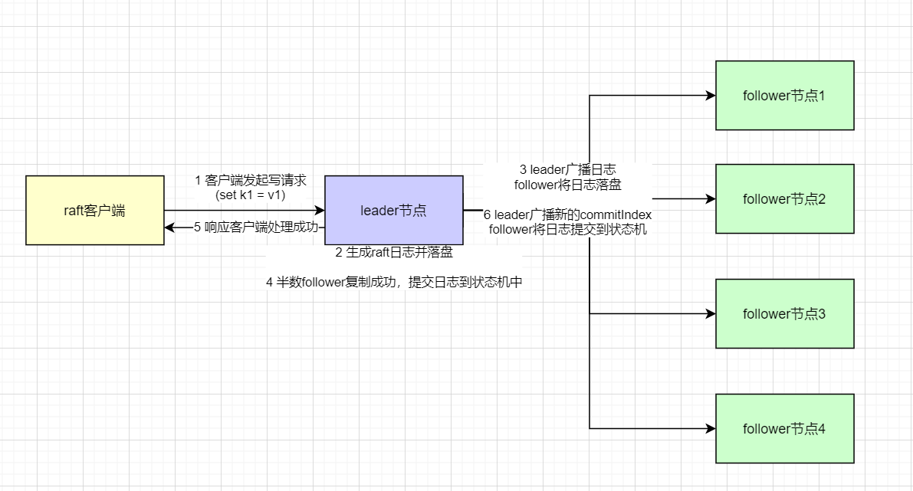
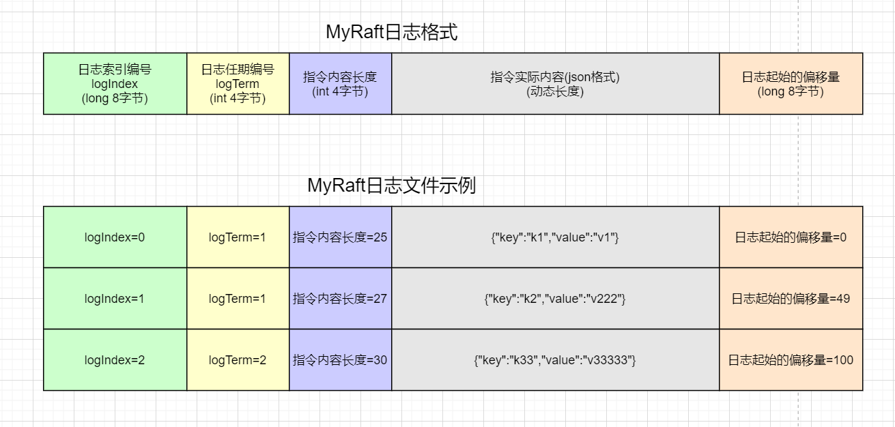
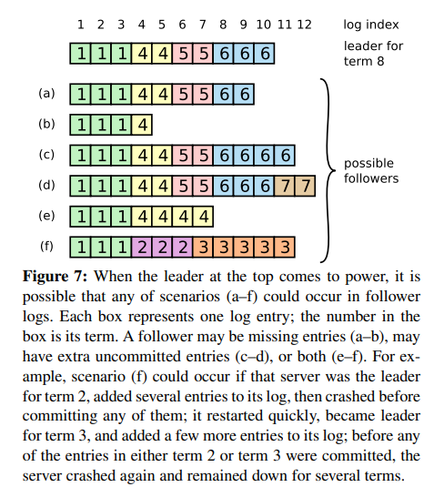
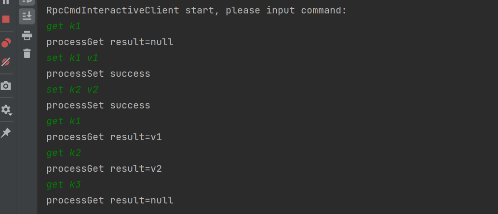

# 手写raft(二) 实现日志复制
## 1. Raft日志复制介绍
在上一篇博客中MyRaft实现了leader选举，为接下来实现日志复制功能打下了基础: [手写raft(一) 实现leader选举](https://www.cnblogs.com/xiaoxiongcanguan/p/17569697.html)  
#####
日志复制是raft最核心也是最复杂的功能，大体上来说一次正常的raft日志复制大致可以简化为以下几步完成：  
1. 客户端向raft集群发送一次操作请求(比如kv数据库状态机的写命令(set k1 v1))，如果接受到请求的节点是leader则受理该请求；
   如果不是leader则转发给自己认为的leader或者返回leader的地址让客户端向leader重新发送请求(如果过程中小概率发生了leader变更，则循环往复直到leader受理)
2. leader在接受到请求后，生成对应的raft日志(logEntry)并追加写入到leader节点本地的日志文件中(整个过程需要加锁，防止多个请求并发而日志乱序)。  
3. leader本地日志追加写入完成后，向集群中的所有follower节点广播该日志(并行的rpc appendEntries)，follower接到该rpc请求后也将日志追加写入到自己的本地日志文件中，并返回成功。  
   当超过半数的follower返回了成功时，leader认为该日志已经成功的复制到了集群中，可以提交到状态机中执行。  
   如果成功的数量少于半数则认为该客户端请求失败，不提交到状态机中，并将本地写入的日志删除掉，让客户端去重试。
4. leader提交日志给状态机后，会修改自己的lastApplied字段(最大已提交日志索引编号)，随后通过心跳等rpc交互令follower也提交本地对应索引的日志到状态机中
5. 至此，一次完整的日志复制过程完成，一切正常的情况下整个集群中所有节点的本地日志中都包含了对应请求的日志，每个节点的状态机也执行了对应日志包含的状态机指令。
##### raft日志复制流程图

#####
* 上面关于raft日志复制功能的介绍看起来不算复杂，在一切正常的情况下系统似乎能很好的完成任务。但raft是一个分布式系统，分布式系统中会出现各种麻烦的异常情况，在上述任务的每一步、任一瞬间都可能出现网络故障、机器宕机(leader/follower都可能处理到一半就宕机)等问题，
而如何在异常情况下依然能让系统正常完成任务就使得raft日志复制的逻辑变得复杂起来了。  
* raft论文中对一些异常情况进行了简要介绍，并通过一些示例来证明算法的正确性。但具体落地到代码实现中还有更多的细节需要考虑，这也是为什么raft论文中反复强调算法易理解的重要性。
* 因为算法容易理解，实现者就能对算法建立起直观的理解，处理异常case时就能更好的理解应该如何做以及为什么这样做是正确的。在下文中将会结合MyRaft的实现源码来详细分析raft是如何处理异常情况的。
## 2. MyRaft日志复制
### 2.1 MyRaft日志复制相关模块简介
为了实现日志复制功能，lab2版本的MyRaft比起lab1额外新增了3个模块，分别是日志模块LogModule、状态机模块SimpleReplicationStateMachine和客户端模块RaftClient。  
##### 日志模块LogModule
* MyRaft的日志模块用于维护raft日志相关的逻辑，出于减少依赖的原因，MyRaft没有去依赖rocksDb等基于本地磁盘的数据库而是直接操作最原始的日志文件(RandomAccessFile)来实现日志存储功能。  
* 简单起见，LogModule直接通过一把全局的读写锁来防止并发问题。
```java
/**
 * raft日志条目
 * */
public class LogEntry implements Serializable {

    /**
     * 发布日志时的leader的任期编号
     * */
    private int logTerm;

    /**
     * 日志的索引编号
     * */
    private long logIndex;

    /**
     * 具体作用在状态机上的指令
     * */
    private Command command;
}
```
LogEntry在磁盘文件中存储的示意图

##### 
[logModule类源码](https://github.com/1399852153/MyRaft/blob/release/lab2_log_replication/raft/src/main/java/myraft/module/LogModule.java)
##### 状态机模块SimpleReplicationStateMachine
* 状态机模块是一个K/V数据模型，本质上就是内存中维护了一个HashMap。状态机的读写操作就是对这个HashMap的读写操作，没有额外的逻辑。
* 同时为了方便观察状态机中的数据状态，每次进行写操作时都整体刷新这个HashMap中的数据到对应的本地文件中(简单起见暂不考虑同步刷盘的性能问题)。
* MyRaft是一个极简的K/V数据库，其只支持最基本的get/set命令，因此作用在状态机中的所有指令天然都是幂等的，是可重复执行的。
#####
```java
/**
 * 指令(取决于实现)
 * */
public interface Command extends Serializable {
}

/**
 * 写操作，把一个key设置为value
 * */
public class SetCommand implements Command {

   private String key;
   private String value;
}

public class GetCommand implements Command{

   private String key;
}
```
##### 客户端模块RaftClient
* Raft客户端模块就是一个rpc的客户端(不依赖注册中心，基于静态服务配置的点对点rpc)，请求时使用负载均衡随机的获得一个raft服务节点访问。
```java
public class RaftClient {

    private final Registry registry;
    private RaftService raftServiceProxy;
    private List<ServiceInfo> serviceInfoList;
    private final LoadBalance loadBalance = new SimpleRoundRobinBalance();

    public RaftClient(Registry registry) {
        this.registry = registry;
    }

    public void init(){
        ConsumerBootstrap consumerBootstrap = new ConsumerBootstrap()
            .registry(registry);

        // 注册消费者
        Consumer<RaftService> consumer = consumerBootstrap.registerConsumer(RaftService.class,new FastFailInvoker());
        this.raftServiceProxy = consumer.getProxy();
    }

    public void setRaftNodeConfigList(List<RaftNodeConfig> raftNodeConfigList) {
        this.serviceInfoList = raftNodeConfigList.stream().map(item->{
            ServiceInfo serviceInfo = new ServiceInfo();
            serviceInfo.setServiceName(RaftService.class.getName());
            serviceInfo.setUrlAddress(new URLAddress(item.getIp(),item.getPort()));
            return serviceInfo;
        }).collect(Collectors.toList());
    }

    public String doRequestRetry(Command command, int retryTime){
        RuntimeException ex = new RuntimeException();
        for(int i=0; i<retryTime; i++){
            try {
                return doRequest(command);
            }catch (Exception e){
                ex = new RuntimeException(e);
                System.out.println("doRequestRetry error, retryTime=" + i);
            }
        }

        // n次重试后还是没成功
        throw ex;
    }

    public String doRequest(Command command){
        // 先让负载均衡选择请求任意节点
        ServiceInfo serviceInfo = loadBalance.select(this.serviceInfoList);
        ClientRequestResult clientRequestResult = doRequest(serviceInfo.getUrlAddress(),command);

        if(clientRequestResult.getLeaderAddress() == null){
            if(!clientRequestResult.isSuccess()){
                throw new MyRpcException("doRequest error!");
            }
            // 访问到了leader，得到结果
            return clientRequestResult.getValue();
        }else{
            // leaderAddress不为空，说明访问到了follower，得到follower给出的leader地址
            URLAddress urlAddress = clientRequestResult.getLeaderAddress();
            // 指定leader的地址去发起请求
            ClientRequestResult result = doRequest(urlAddress,command);

            return result.getValue();
        }
    }

    private ClientRequestResult doRequest(URLAddress urlAddress, Command command){
        // 相当于是点对点的rpc，用这种方式比较奇怪，但可以不依赖zookeeper这样的注册中心
        ConsumerRpcContextHolder.getConsumerRpcContext().setTargetProviderAddress(urlAddress);
        ClientRequestParam clientRequestParam = new ClientRequestParam(command);
        ClientRequestResult clientRequestResult = this.raftServiceProxy.clientRequest(clientRequestParam);
        ConsumerRpcContextHolder.removeConsumerRpcContext();

        return clientRequestResult;
    }
}
```
### 2.2 MyRaft日志复制实现分析
##### MyRaft处理客户端请求
* raft是一个强一致的读写模型，只有leader才能对外进行服务。因此raft服务节点收到来自客户端的请求时，需要判断一下自己是否是leader，如果不是leader就返回自己认为的leader地址给客户端，让客户端重试。  
raft是一个分布式模型，在出现网络分区等情况下，原来是leader的节点(term更小的老leader)可能并不是目前真正的leader，而这个情况下接到客户端请求的老leader就会错误的处理客户端的请求，因而需要额外的机制来保证raft强一致的读写特性。  
* 线性强一致的写：raft的leader节点在处理客户端请求时会加写锁(线性一致)。提交指令到状态机中执行前，会预先写入一份本地日志，并将本地日志广播到集群中的所有follower节点上。如果自己已经不再是合法的leader，则本地日志的广播是无法在超过半数的节点上执行成功的。
  反过来说，只要大多数的节点都成功完成了日志复制的rpc请求(appendEntries)，则该写操作就是强一致下的写，因此可以将命令安全的提交到状态机中并向客户端返回成功。
* 线性强一致的读：强一致的读就不能让老leader处理读请求，因为很可能老leader相比实际上合法的新leader缺失了一些最新的写操作，而导致返回过时的数据(破坏了强一致读的语义)。因此对于读指令，业界提出了几种常见的确保强一致读的方案。
#####
|                       | 介绍                                                                                                                                                | 优点           | 缺点                                    |
|-----------------------|---------------------------------------------------------------------------------------------------------------------------------------------------|--------------|---------------------------------------|
| 1.读写一视同仁              | 读操作也和写操作一样生成raftLog，并且向集群广播。如果广播得到了大多数节点的成功响应则作用到状态机中得到结果                                                                                         | 简单;易理解，易实现   | 相比其它方案，生成了太多不必要的读请求日志，性能极差            |
| 2.每次读操作前再确认一次leader地位 | 处理读操作前向集群发一个心跳广播，如果发现自己依然是leader则处理读请求                                                                                                            | 简单;容易实现      | 每次读请求都需要广播确认leader地位，性能也不是很好          |
| 3.周期性续期确认leader地位     | raft的论文中提到，leader选举的超时时间不能太小，否则心跳广播等无法抑制新选举。那么由此可得，当一次心跳广播确认leader地位后，在选举超时时间范围内自己一定还是集群中的合法leader。因此在一次周期心跳确认leader成功后，在选举超时时间范围内，所有的读请求都直接处理即可。 | 在高并发场合下性能会很好 | 实现起来稍显复杂，对本地时钟准确性有一定要求(不准就会有可能破坏强一致读) |
  MyRaft考虑到实现的简单性，选择了方案2来实现强一致的读。
#####
```java
    public ClientRequestResult clientRequest(ClientRequestParam clientRequestParam) {
        // 不是leader
        if(this.serverStatusEnum != ServerStatusEnum.LEADER){
            if(this.currentLeader == null){
                // 自己不是leader，也不知道谁是leader直接报错
                throw new MyRaftException("current node not leader，and leader is null! serverId=" + this.serverId);
            }

            RaftNodeConfig leaderConfig = this.raftConfig.getRaftNodeConfigList()
                .stream().filter(item-> Objects.equals(item.getServerId(), this.currentLeader)).findAny().get();

            // 把自己认为的leader告诉客户端(也可以改为直接转发请求)
            ClientRequestResult clientRequestResult = new ClientRequestResult();
            clientRequestResult.setLeaderAddress(new URLAddress(leaderConfig.getIp(),leaderConfig.getPort()));

            logger.info("not leader response known leader, result={}",clientRequestResult);
            return clientRequestResult;
        }

        // 是leader，处理读请求(线性一致读)
        if(clientRequestParam.getCommand() instanceof GetCommand){
            // 线性强一致的读，需要先进行一次心跳广播，判断当前自己是否还是leader
            boolean stillBeLeader = HeartbeatBroadcastTask.doHeartbeatBroadcast(this);
            if(stillBeLeader){
                // 还是leader，可以响应客户端
                logger.info("do client read op, still be leader");

                // Read-only operations can be handled without writing anything into the log.
                GetCommand getCommand = (GetCommand) clientRequestParam.getCommand();

                // 直接从状态机中读取就行
                String value = this.kvReplicationStateMachine.get(getCommand.getKey());

                ClientRequestResult clientRequestResult = new ClientRequestResult();
                clientRequestResult.setSuccess(true);
                clientRequestResult.setValue(value);

                logger.info("response getCommand, result={}",clientRequestResult);

                return clientRequestResult;
            }else{
                logger.info("do client read op, not still be leader");

                // 广播后发现自己不再是leader了，报错，让客户端重新自己找leader (客户端和当前节点同时误判，小概率发生)
                throw new MyRaftException("do client read op, but not still be leader!" + this.serverId);
            }
        }

        // 自己是leader，需要处理客户端的写请求

        // 构造新的日志条目
        LogEntry newLogEntry = new LogEntry();
        newLogEntry.setLogTerm(this.raftServerMetaDataPersistentModule.getCurrentTerm());
        // 新日志的索引号为当前最大索引编号+1
        newLogEntry.setLogIndex(this.logModule.getLastIndex() + 1);
        newLogEntry.setCommand(clientRequestParam.getCommand());

        logger.info("handle setCommand, do writeLocalLog entry={}",newLogEntry);

        // 预写入日志
        logModule.writeLocalLog(Collections.singletonList(newLogEntry));

        logger.info("handle setCommand, do writeLocalLog success!");

        List<AppendEntriesRpcResult> appendEntriesRpcResultList = logModule.replicationLogEntry(newLogEntry);

        logger.info("do replicationLogEntry, result={}",appendEntriesRpcResultList);

        // successNum需要加上自己的1票
        long successNum = appendEntriesRpcResultList.stream().filter(AppendEntriesRpcResult::isSuccess).count() + 1;
        if(successNum >= this.raftConfig.getMajorityNum()){
            // If command received from client: append entry to local log, respond after entry applied to state machine (§5.3)

            // 成功复制到多数节点

            // 设置最新的已提交索引编号
            logModule.setLastCommittedIndex(newLogEntry.getLogIndex());
            // 作用到状态机上
            this.kvReplicationStateMachine.apply((SetCommand) newLogEntry.getCommand());
            // 思考一下：lastApplied为什么不需要持久化？ 状态机指令的应用和更新lastApplied非原子性会产生什么问题？
            logModule.setLastApplied(newLogEntry.getLogIndex());

            // 返回成功
            ClientRequestResult clientRequestResult = new ClientRequestResult();
            clientRequestResult.setSuccess(true);

            return clientRequestResult;
        }else{
            // 没有成功复制到多数,返回失败
            ClientRequestResult clientRequestResult = new ClientRequestResult();
            clientRequestResult.setSuccess(false);

            // 删掉之前预写入的日志条目
            // 思考一下如果删除完成之前，宕机了有问题吗？ 个人感觉是ok的
            logModule.deleteLocalLog(newLogEntry.getLogIndex());

            return clientRequestResult;
        }
    }
```
##### leader向集群广播raftLog
下面详细介绍leader是如何向集群广播raftLog的。
* raft的leader维护了两个非持久化的数据(Volatile state on leaders)，即在当前leader视角下follower节点同步raftLog的进度。  
  一个数据是nextIndex，代表leader认为的follower应该接收的下一条log的索引值，leader初始化时乐观的估计设置其为leader当前最后一条日志索引值加1(代表着乐观估计follower和leader的日志进度是完全一致的)。  
  一个数据是matchIndex，代表leader实际确认的follower已接受到的最后一条raft日志的索引值，leader初始化时悲观的将其初始化为0。  
  由于follower是一个集合，所以论文中通过nextIndex[],matchIndex[]来描述，而在MyRaft中都用Map结构来维护。
* leader基于每个follower对应的nextIndex查找出所要发送的日志集合，并行的向所有follower发送appendEntries的rpc请求。
  当leader与follower进行rpc交互时，可能follower的日志同步进度并不像leader认为的那样乐观，很可能其实际所拥有的日志索引远小于leader最后一条日志的索引(follower侧的逻辑在下一节分析)。   
  因此follower在这种情况下会返回失败，此时leader会将对应follower的nextIndex往回退(自减1)，循环往复的交互直到leader发送和follower所需的日志相匹配的那条日志(最坏情况下follower一条日志都没有，leader从第一条日志开始同步)
* 当follower响应成功后，leader将会更新对应follower的nextIndex和matchIndex的值。当超过半数的follower都响应了对应index日志的appendEntries后，leader认为当前日志已经成功的复制到集群中多数的节点中了，则可以安全的将日志提交到状态机中了。
#####
```java
/**
     * 向集群广播，令follower复制新的日志条目
     * */
    public List<AppendEntriesRpcResult> replicationLogEntry(LogEntry lastEntry) {
        List<RaftService> otherNodeInCluster = currentServer.getOtherNodeInCluster();

        List<Future<AppendEntriesRpcResult>> futureList = new ArrayList<>(otherNodeInCluster.size());

        for(RaftService node : otherNodeInCluster){
            // 并行发送rpc，要求follower复制日志
            Future<AppendEntriesRpcResult> future = this.rpcThreadPool.submit(()->{
                logger.info("replicationLogEntry start!");

                long nextIndex = this.currentServer.getNextIndexMap().get(node);

                AppendEntriesRpcResult finallyResult = null;

                // If last log index ≥ nextIndex for a follower: send AppendEntries RPC with log entries starting at nextIndex
                while(lastEntry.getLogIndex() >= nextIndex){
                    AppendEntriesRpcParam appendEntriesRpcParam = new AppendEntriesRpcParam();
                    appendEntriesRpcParam.setLeaderId(currentServer.getServerId());
                    appendEntriesRpcParam.setTerm(currentServer.getCurrentTerm());
                    appendEntriesRpcParam.setLeaderCommit(this.lastCommittedIndex);

                    int appendLogEntryBatchNum = this.currentServer.getRaftConfig().getAppendLogEntryBatchNum();

                    // 要发送的日志最大index值
                    // (追进度的时候，就是nextIndex开始批量发送appendLogEntryBatchNum-1条(左闭右闭区间)；如果进度差不多那就是以lastEntry.index为界限全部发送出去)
                    long logIndexEnd = Math.min(nextIndex+(appendLogEntryBatchNum-1), lastEntry.getLogIndex());
                    // 读取出[nextIndex-1,logIndexEnd]的日志(左闭右闭区间),-1往前一位是为了读取出preLog的信息
                    List<LocalLogEntry> localLogEntryList = this.readLocalLog(nextIndex-1,logIndexEnd);

                    logger.info("replicationLogEntry doing! nextIndex={},logIndexEnd={},LocalLogEntryList={}",
                        nextIndex,logIndexEnd,JsonUtil.obj2Str(localLogEntryList));

                    List<LogEntry> logEntryList = localLogEntryList.stream()
                        .map(LogEntry::toLogEntry)
                        .collect(Collectors.toList());

                    // 索引区间大小
                    long indexRange = (logIndexEnd - nextIndex + 1);
                    if(logEntryList.size() == indexRange+1){
                        // 一般情况能查出区间内的所有日志

                        logger.info("find log size match!");
                        // preLog
                        LogEntry preLogEntry = logEntryList.get(0);
                        // 实际需要传输的log
                        List<LogEntry> needAppendLogList = logEntryList.subList(1,logEntryList.size());
                        appendEntriesRpcParam.setEntries(needAppendLogList);
                        appendEntriesRpcParam.setPrevLogIndex(preLogEntry.getLogIndex());
                        appendEntriesRpcParam.setPrevLogTerm(preLogEntry.getLogTerm());
                    }else if(logEntryList.size() > 0 && logEntryList.size() <= indexRange){
                        logger.info("find log size not match!");
                        // 日志长度小于索引区间值，说明已经查到最前面的日志 (比如appendLogEntryBatchNum=5，但一共只有3条日志全查出来了)
                        appendEntriesRpcParam.setEntries(logEntryList);

                        // 约定好第一条记录的prev的index和term都是-1
                        appendEntriesRpcParam.setPrevLogIndex(-1);
                        appendEntriesRpcParam.setPrevLogTerm(-1);
                    } else{
                        // 正常情况是先持久化然后再广播同步日志，所以size肯定会大于0，也不应该超过索引区间值
                        // 走到这里不符合预期，日志模块有bug
                        throw new MyRaftException("replicationLogEntry logEntryList size error!" +
                            " nextIndex=" + nextIndex + " logEntryList.size=" + logEntryList.size());
                    }

                    logger.info("leader do appendEntries start, node={}, appendEntriesRpcParam={}",node,appendEntriesRpcParam);
                    AppendEntriesRpcResult appendEntriesRpcResult = node.appendEntries(appendEntriesRpcParam);
                    logger.info("leader do appendEntries end, node={}, appendEntriesRpcResult={}",node,appendEntriesRpcResult);

                    finallyResult = appendEntriesRpcResult;
                    // 收到更高任期的处理
                    boolean beFollower = currentServer.processCommunicationHigherTerm(appendEntriesRpcResult.getTerm());
                    if(beFollower){
                        return appendEntriesRpcResult;
                    }

                    if(appendEntriesRpcResult.isSuccess()){
                        logger.info("appendEntriesRpcResult is success, node={}",node);

                        // If successful: update nextIndex and matchIndex for follower (§5.3)

                        // 同步成功了，nextIndex递增一位
                        this.currentServer.getNextIndexMap().put(node,nextIndex+1);
                        this.currentServer.getMatchIndexMap().put(node,nextIndex);

                        nextIndex++;
                    }else{
                        // 因为日志对不上导致一致性检查没通过，同步没成功，nextIndex往后退一位

                        logger.info("appendEntriesRpcResult is false, node={}",node);

                        // If AppendEntries fails because of log inconsistency: decrement nextIndex and retry (§5.3)
                        nextIndex--;
                        this.currentServer.getNextIndexMap().put(node,nextIndex);
                    }
                }

                if(finallyResult == null){
                    // 说明有bug
                    throw new MyRaftException("replicationLogEntry finallyResult is null!");
                }

                logger.info("finallyResult={},node={}",node,finallyResult);

                return finallyResult;
            });

            futureList.add(future);
        }

        // 获得结果
        List<AppendEntriesRpcResult> appendEntriesRpcResultList = CommonUtil.concurrentGetRpcFutureResult(
                "do appendEntries", futureList,
                this.rpcThreadPool,2, TimeUnit.SECONDS);

        logger.info("leader replicationLogEntry appendEntriesRpcResultList={}",appendEntriesRpcResultList);

        return appendEntriesRpcResultList;
    }
```
##### follower处理appendEntries请求
* 相比lab1，lab2版本的appendEntries除了之前已有的针对leader任期相关的校验和处理逻辑外，还新增了日志复制相关的逻辑。  
* raftLog是顺序保存的，为了日志复制的安全性，raft的follower节点也必须和leader保持一致，将日志按照index索引值以从小到大的顺序存在本地的raft日志文件中。  
  因此只有在已有第0-第N条日志的情况下，follower才能够安全的将第N+1条日志追加到本地日志文件中。为此raft作者设计了一系列的校验规则来保证这一点。
* 首先，leader在发起appendEntries命令follower复制第N条(logIndex=N)日志时，会将第前一条日志(N-1)的term值(prevLogTerm)和index值(prevLogIndex)作为参数一并传递，follower会对这两个值进行校验以决定是否能安全的复制日志。    
  follower会查询出对应索引为prevLogIndex的日志，如果没查出来说明进度没跟上leader那自然要返回复制失败，让leader重试把logIndex更小、更前面的日志发过来。  
  如果查出来了对应的日志则还需要进一步对比请求参数中的prevLogTerm和follower本地对应日志的term值是否一致，如果一致则校验通过；如果不一致则说明follower保存了一个和leader不一致且未最终提交的日志，也要返回失败，让leader把更前面的日志发过来(具体原理后面会分析)。  
* 当follower这边对于prevLogTerm和prevLogIndex的校验都通过了后，说明leader此时已经找到了follower恰好需要的日志(日志同步的进度匹配上了)，则follower需要将发送过来的日志写入本地日志文件中。  
  如果leader发过来的日志里对应index的本地日志不存在则直接追加到follower本地日志文件中即可；如果之前已存在则覆盖掉原来的日志即可。  
* 当一开始follower没有追上leader的日志进度时(比如follower宕机了一段时间再回到集群)，follower会一直返回同步失败，leader则会一直向前找直到找到follower所恰好需要的那条日志。在这之后的日志同步就会十分顺利了，直到follower和leader的日志完全一致。  
* 考虑到follower可能和leader的日志进度相差过大，一次回退一个索引值的匹配策略效率并不高。论文中提到一种可行的优化是让follower直接把自己的最后一个日志，或者倒数第N个日志的信息(term和index)返回给leader，leader就能够很快的从正确的日志位点开始同步。  
  但这样会增加程序的复杂度并降低正常情况下进度一致时日志同步的效率，论文的作者认为出现这一问题的概率很低因此该优化是不必要的，简单起见MyRaft也没有做相关的优化。
* follower在成功将日志落盘后，根据请求参数中的leaderCommit值和自己本地的lastCommittedIndex(最大已提交日志索引号)来判断是否应该将本地的raftLog提交到状态机中执行。  
  如果参数leaderCommit大于本地的lastCommittedIndex，说明leader已经把一些日志提交到状态机中了，而follower还没有。那么follower需要跟上leader的进度(不但日志进度要匹配，状态机进度也要匹配)。  
  需要提交到状态机中日志最大的index值为leaderCommit和当前最新一条日志的index最小值(index of last new entry)，如果leaderCommit是最小值，说明follower已经赶上了leader，leader提交的日志follower本地都有。  
  而如果index of last new entry是更小的，说明当前follower还没有追上leader提交到状态机的进度，把当前已有的所有本地日志都提交到状态机中即可(pushStatemachineApply方法)。
##### 为什么follower除了校验prevIndex还需要校验prevTerm?
raft论文在第5.3节重点解释了一下原因，。 
1. 举个例子，一个5节点的集群，节点编号分别是abcde。在任期1中a是leader，尝试向集群复制一个日志(index=1，term=1，set k1=v1)，但是复制时失败了，只有节点b成功的复制了该日志，而cde都没有持有日志。  
2. 恰好这时leader a宕机了，触发新选举后节点c成为了新的leader(任期term=2)。c接受到客户端请求，也尝试向集群复制一个日志(index=1，term=2, set k1=v2)，这个时候节点b有一个index=1，这个时候节点b必须让新的日志覆盖掉老的日志才能和leader保持一致。  
3. c的这次日志复制成功了，bcde四个节点都持有了该日志，则raft集群便可以将这个日志提交到状态机中了，最后集群的所有状态机中k1的值将会是v2，而不是之前复制失败而未提交的v1。
#####

#####
```java
    public AppendEntriesRpcResult appendEntries(AppendEntriesRpcParam appendEntriesRpcParam) {
        if(appendEntriesRpcParam.getTerm() < this.raftServerMetaDataPersistentModule.getCurrentTerm()){
            // Reply false if term < currentTerm (§5.1)
            // 拒绝处理任期低于自己的老leader的请求

            logger.info("doAppendEntries term < currentTerm");
            return new AppendEntriesRpcResult(this.raftServerMetaDataPersistentModule.getCurrentTerm(),false);
        }

        if(appendEntriesRpcParam.getTerm() >= this.raftServerMetaDataPersistentModule.getCurrentTerm()){
            // appendEntries请求中任期值如果大于自己，说明已经有一个更新的leader了，自己转为follower，并且以对方更大的任期为准
            this.serverStatusEnum = ServerStatusEnum.FOLLOWER;
            this.currentLeader = appendEntriesRpcParam.getLeaderId();
            this.raftServerMetaDataPersistentModule.setCurrentTerm(appendEntriesRpcParam.getTerm());
        }

        if(appendEntriesRpcParam.getEntries() == null || appendEntriesRpcParam.getEntries().isEmpty()){
            // 来自leader的心跳处理，清理掉之前选举的votedFor
            this.cleanVotedFor();
            // entries为空，说明是心跳请求，刷新一下最近收到心跳的时间
            raftLeaderElectionModule.refreshLastHeartbeatTime();

            long currentLastCommittedIndex = logModule.getLastCommittedIndex();
            logger.debug("doAppendEntries heartbeat leaderCommit={},currentLastCommittedIndex={}",
                appendEntriesRpcParam.getLeaderCommit(),currentLastCommittedIndex);

            if(appendEntriesRpcParam.getLeaderCommit() > currentLastCommittedIndex) {
                // 心跳处理里，如果leader当前已提交的日志进度超过了当前节点的进度，令当前节点状态机也跟上
                // 如果leaderCommit >= logModule.getLastIndex(),说明当前节点的日志进度不足，但可以把目前已有的日志都提交给状态机去执行
                // 如果leaderCommit < logModule.getLastIndex(),说明当前节点进度比较快，有一些日志是leader已复制但还没提交的，把leader已提交的那一部分作用到状态机就行
                long minNeedCommittedIndex = Math.min(appendEntriesRpcParam.getLeaderCommit(), logModule.getLastIndex());
                pushStatemachineApply(minNeedCommittedIndex);
            }

            // 心跳请求，直接返回
            return new AppendEntriesRpcResult(this.raftServerMetaDataPersistentModule.getCurrentTerm(),true);
        }

        // logEntries不为空，是真实的日志复制rpc

        logger.info("do real log append! appendEntriesRpcParam={}",appendEntriesRpcParam);
        // AppendEntry可靠性校验，如果prevLogIndex和prevLogTerm不匹配，则需要返回false，让leader发更早的日志过来
        {
            LogEntry localPrevLogEntry = logModule.readLocalLog(appendEntriesRpcParam.getPrevLogIndex());
            if(localPrevLogEntry == null){
                // 当前节点日志条目为空，说明完全没有日志(默认任期为-1，这个是约定)
                localPrevLogEntry = LogEntry.getEmptyLogEntry();
            }

            if (localPrevLogEntry.getLogTerm() != appendEntriesRpcParam.getPrevLogTerm()) {
                //  Reply false if log doesn’t contain an entry at prevLogIndex
                //  whose term matches prevLogTerm (§5.3)
                //  本地日志和参数中的PrevLogIndex和PrevLogTerm对不上(对应日志不存在，或者任期对不上)
                logger.info("doAppendEntries localPrevLogEntry not match, localLogEntry={}",localPrevLogEntry);

                return new AppendEntriesRpcResult(this.raftServerMetaDataPersistentModule.getCurrentTerm(),false);
            }
        }

        // 走到这里说明找到了最新的一条匹配的记录
        logger.info("doAppendEntries localEntry is match");

        List<LogEntry> newLogEntryList = appendEntriesRpcParam.getEntries();

        // 1. Append any new entries not already in the log
        // 2. If an existing entry conflicts with a new one (same index but different terms),
        //    delete the existing entry and all that follow it (§5.3)
        // 新日志的复制操作（直接整个覆盖掉prevLogIndex之后的所有日志,以leader发过来的日志为准）
        logModule.writeLocalLog(newLogEntryList, appendEntriesRpcParam.getPrevLogIndex());

        // If leaderCommit > commitIndex, set commitIndex = min(leaderCommit, index of last new entry)
        if(appendEntriesRpcParam.getLeaderCommit() > logModule.getLastCommittedIndex()){
            // 如果leaderCommit更大，说明当前节点的同步进度慢于leader，以新的entry里的index为准(更高的index还没有在本地保存(因为上面的appendEntry有效性检查))
            // 如果index of last new entry更大，说明当前节点的同步进度是和leader相匹配的，commitIndex以leader最新提交的为准

            LogEntry lastNewEntry = newLogEntryList.get(newLogEntryList.size()-1);
            long lastCommittedIndex = Math.min(appendEntriesRpcParam.getLeaderCommit(), lastNewEntry.getLogIndex());
            pushStatemachineApply(lastCommittedIndex);
        }

        // 返回成功
        return new AppendEntriesRpcResult(this.raftServerMetaDataPersistentModule.getCurrentTerm(), true);
    }

    private void pushStatemachineApply(long lastCommittedIndex){
        long lastApplied = logModule.getLastApplied();

        // If commitIndex > lastApplied: increment lastApplied, apply log[lastApplied] to state machine (§5.3)
        if(lastApplied < lastCommittedIndex){
            // 作用在状态机上的日志编号低于集群中已提交的日志编号，需要把这些已提交的日志都作用到状态机上去
            logger.info("pushStatemachineApply.apply, lastApplied={},lastCommittedIndex={}",lastApplied,lastCommittedIndex);

            // 全读取出来(读取出来是按照index从小到大排好序的)
            List<LocalLogEntry> logEntryList = logModule.readLocalLog(lastApplied+1,lastCommittedIndex);

            logger.info("pushStatemachineApply.apply, logEntryList={}",logEntryList);

            List<SetCommand> setCommandList = logEntryList.stream()
                .filter(item->item.getCommand() instanceof SetCommand)
                .map(item->(SetCommand)item.getCommand())
                .collect(Collectors.toList());

            // 按照顺序依次作用到状态机中
            this.kvReplicationStateMachine.batchApply(setCommandList);
        }

        this.logModule.setLastCommittedIndex(lastCommittedIndex);
        this.logModule.setLastApplied(lastCommittedIndex);
    }
```
##### leader选举时requestVote的安全性校验
* 前面的例子里提到在老leader宕机触发选举后，新的leader是可能把一些不一致的日志给覆盖清除掉以保证日志一致性。  
  当leader广播日志并在半数以上follower成功复制后，并提交raftLog到状态机中后如果leader突然宕机了，raft是如何保证新的leader不会清理掉已提交到状态机中的日志的呢？
* raft的论文在5.4节安全性一节中提到了这一点，raft作者通过在leader选举过程中follower投票的环节中添加对双方日志的校验来保证已提交到状态机的日志绝对不会被覆盖。  
  raft论文中保证安全性的核心思路共两点：一是candidate必须和超过半数的follower进行通信并得到选票；二是candidate的日志至少要和follower一样新(即follower有的日志candidate必须本地也有，反之则不需要成立)。  
  基于这两点后能以此推导：已提交的日志一定在集群中超过半数的节点中存在 + 新当选的leader所包含的日志一定比集群中超过半数的节点更全面(至少一样全面) => 新的leader一定包含所有已提交的日志(只有包含所有已提交日志的节点才能被选为leader)
* 那raft是如何在选举投票时令follower和candidate进行日志完整程度比对的呢？raft论文的5.4节中也提到了，具体规则如下：  
  Raft通过比较两个节点中日志中最后一个条目的索引和任期来决定谁是最新的。  
  1. 如果两个日志中最后的条目有着不同的任期，则任期较后的日志是更新的。  
  2. 如果两个日志中最后的条目有着相同的任期，则较长的(注：索引值更大的)那个日志是更新的。  
* candidate的requestVote的请求中会带上candidate自己最后一条日志的任期(lastLogTerm)和索引值(lastLogIndex),而处理请求的follower也需要查询出自己本地的最后一条日志出来，并基于上述规则比较到底是哪边的日志更新，更全面。   
  只有当candidate的日志完整程度大于(更新)或等于(一样新)follower本地的日志时，follower才能将选票给到candidate。
* 有了在选举逻辑中关于日志的完整性的校验，raft的日志复制功能就算基本完成了。而为什么这样的设计能保证日志复制的安全性，不会造成节点间数据的不一致，在raft的论文中有提到，在这里就不再赘述了。  
  raft论文中给出的关于日志复制正确性的结论并不是那么显然(因为有不少异常的case需要琢磨)，希望读者能通过仔细推敲论文并自己动手实现raft来加深理解。 
#####
在上一小节的例子中，假设任期1中的a成功的复制了日志，并且在b、c节点上复制成功，而d、e上没有复制成功。那么如果a在提交日志到状态机后宕机，则只有b、c才可能被选举为leader，因为b、c会拒绝来自d、e的requestVote(b、c的日志比d、e的新)而令其无法获得半数以上的选票，而反过来d、e则会同意投票给b、c。
#####
```java
 /**
     * 处理投票请求
     * 注意：synchronized修饰防止不同candidate并发的投票申请处理，以FIFO的方式处理
     * */
    public synchronized RequestVoteRpcResult requestVoteProcess(RequestVoteRpcParam requestVoteRpcParam){
        if(this.currentServer.getCurrentTerm() > requestVoteRpcParam.getTerm()){
            // Reply false if term < currentTerm (§5.1)
            // 发起投票的candidate任期小于当前服务器任期，拒绝投票给它
            logger.info("reject requestVoteProcess! term < currentTerm, currentServerId={}",currentServer.getServerId());
            return new RequestVoteRpcResult(this.currentServer.getCurrentTerm(),false);
        }

        // 发起投票的节点任期高于当前节点，无条件投票给它(任期高的说了算)
        if(this.currentServer.getCurrentTerm() < requestVoteRpcParam.getTerm()){
            // 刷新元数据
            this.currentServer.refreshRaftServerMetaData(
                new RaftServerMetaData(requestVoteRpcParam.getTerm(),requestVoteRpcParam.getCandidateId()));
            // 任期没它高，自己转为follower
            this.currentServer.setServerStatusEnum(ServerStatusEnum.FOLLOWER);
            return new RequestVoteRpcResult(this.currentServer.getCurrentTerm(),true);
        }

        // term任期值相同，需要避免同一任期内投票给不同的节点而脑裂
        if(this.currentServer.getVotedFor() != null && !this.currentServer.getVotedFor().equals(requestVoteRpcParam.getCandidateId())){
            // If votedFor is null or candidateId（取反的卫语句）
            // 当前服务器已经把票投给了别人,拒绝投票给发起投票的candidate
            logger.info("reject requestVoteProcess! votedFor={},currentServerId={}",
                currentServer.getVotedFor(),currentServer.getServerId());
            return new RequestVoteRpcResult(this.currentServer.getCurrentTerm(),false);
        }

        // 考虑日志条目索引以及任期值是否满足条件的情况（第5.4节中提到的安全性）
        // 保证leader必须拥有所有已提交的日志，即发起投票的candidate日志一定要比投票给它的节点更新
        LogEntry lastLogEntry = currentServer.getLogModule().getLastLogEntry();
        logger.info("requestVoteProcess lastLogEntry={}",lastLogEntry);
        if(lastLogEntry.getLogTerm() > requestVoteRpcParam.getLastLogTerm()){
            // If the logs have last entries with different terms, then the log with the later term is more up-to-date.
            // 当前节点的last日志任期比发起投票的candidate更高(比candidate更新)，不投票给它
            logger.info("lastLogEntry.term > candidate.lastLogTerm! voteGranted=false");
            return new RequestVoteRpcResult(this.currentServer.getCurrentTerm(),false);
        }else if(lastLogEntry.getLogTerm() == requestVoteRpcParam.getLastLogTerm() &&
            lastLogEntry.getLogIndex() > requestVoteRpcParam.getLastLogIndex()){
            // If the logs end with the same term, then whichever log is longer is more up-to-date.
            // 当前节点的last日志和发起投票的candidate任期一样，但是index比candidate的高(比candidate更新)，不投票给它

            logger.info("lastLogEntry.term == candidate.lastLogTerm && " +
                "lastLogEntry.index > candidate.lastLogIndex! voteGranted=false");
            return new RequestVoteRpcResult(this.currentServer.getCurrentTerm(),false);
        }else{
            // candidate的日志至少与当前节点一样新(或者更新)，通过检查，可以投票给它
            logger.info("candidate log at least as new as the current node, valid passed!");
        }

        // 投票校验通过,刷新元数据
        this.currentServer.refreshRaftServerMetaData(
            new RaftServerMetaData(requestVoteRpcParam.getTerm(),requestVoteRpcParam.getCandidateId()));
        this.currentServer.processCommunicationHigherTerm(requestVoteRpcParam.getTerm());
        return new RequestVoteRpcResult(this.currentServer.getCurrentTerm(),true);
    }
```
## 3. 日志复制过程中异常情况分析
在raft日志复制的过程中的任意瞬间，集群中的每个节点都可能出现宕机、网络超时等异常情况。下面分析在出现这些异常时，raft是如何保证集群正常工作的。
###3.1 client请求leader时，leader恰好宕机
client请求报错，client重试直到raft服务集群选举出新的leader后恢复工作。
###3.2 leader接受了client的请求，将raftLog本地成功落盘后，广播日志前宕机
client请求报错，重试直到选举出新leader(下面的异常情况client也是一样的处理)。  
raft集群会进行选举选出新leader。宕机的老leader在回到集群后对应index的本地日志将会被新leader给覆盖掉。
###3.3 leader将raftLog落盘后，将日志广播给follower时，follower处理成功的数量未超过半数，leader宕机(没来得及删除本地未提交的raftLog)
当leader广播将日志复制到少数节点中宕机，则可能存在两种情况。
1. 成功落盘的少数节点在新一轮选举中当选leader，则宕机的老leader回到集群后已经落盘的对应raftLog会被保留下来。
2. 未成功落盘的节点当选了新leader，则宕机的老leader已经落盘的对应raftLog将会被覆盖清除掉。
这两种情况都是正确的，因为未提交到状态机中的日志无论是被覆盖清除还是最终被提交，都是合理的。
###3.4 leader将raftLog落盘后，将日志广播给follower时，follower处理成功的数量超过半数，leader提交命令到状态机前宕机
如果对应log成功复制到了多数节点中，则按照上面所分析的raft选举安全性，只有拥有最新raftLog的那多数的节点才有机会当选为新leader。
因此宕机的老leader重新回到集群后，落盘的raftLog将会被保留下来。
###3.5 leader提交命令到状态机后，响应client前宕机
整个集群的处理和3.4一样，宕机的老leader重新回到集群后，落盘的raftLog将会被保留下来。**唯一的区别在于宕机leader节点的状态机将会重复执行同一条raftLog**。  
解决这一问题的方法主要有两种：  
1. 要求状态机的具体实现能够容忍raftLog重复的执行，或者设计对相同log幂等的防护(MyRaft的方案，状态机数据不持久化并且只有纯set操作，无自增/自减等非幂等操作)。
2. raft协议的实现中将lastApplied属性持久化，通过持久化lastApplied的方式来避免宕机恢复后重复执行日志。
#####
[为什么 Raft 的 ApplyIndex 和 CommitIndex 不需要持久化？](https://www.zhihu.com/question/382888510/answer/2478166051)

## 4. MyRaft日志复制功能验证
##### 命令行交互式客户端介绍
MyRaft实现了一个非常基础的命令行交互式客户端(RpcCmdInteractiveClient)用于测试MyRaft这一kv数据库的读写功能。
```java
/**
 * 命令行交互的客户端
 *
 * 只支持以下命令
 * 1. get [key]
 * 2. set [key] [value]
 * 3. quit
 * */
public class RpcCmdInteractiveClient {

    public static void main(String[] args) {
        // 客户端的超时时间必须大于raft内部rpc的超时时间，否则在节点故障时rpc会一直超时
        DefaultFuture.DEFAULT_TIME_OUT = 3000L;

        RaftClient raftClient = new RaftClient(RaftClusterGlobalConfig.registry);
        raftClient.init();
        raftClient.setRaftNodeConfigList(RaftClusterGlobalConfig.raftNodeConfigList);

        Scanner scan = new Scanner(System.in);

        System.out.println("RpcCmdInteractiveClient start, please input command:");

        while(scan.hasNext()) {
            String input = scan.nextLine();
            if(input.length() == 0){
                continue;
            }

            if (Objects.equals(input, "quit")) {
                scan.close();
                System.out.println("RpcCmdInteractiveClient quit success!");
                return;
            }

            if (input.startsWith("get")) {
                processGetCmd(raftClient,input);
            }else if(input.startsWith("set")){
                processSetCmd(raftClient,input);
            }else{
                System.out.println("un support cmd, please retry！");
            }
        }
    }

    private static void processGetCmd(RaftClient raftClient, String input){
        try {
            String[] cmdItem = input.split(" ");
            if (cmdItem.length != 2) {
                System.out.println("get cmd error, please retry！");
                return;
            }

            String key = cmdItem[1];
            String result = raftClient.doRequestRetry(new GetCommand(key),2);
            System.out.println("processGet result=" + result);
        }catch (Exception e){
            System.out.println("processGet error!");
            e.printStackTrace();
        }
    }

    private static void processSetCmd(RaftClient raftClient, String input){
        try {
            String[] cmdItem = input.split(" ");
            if (cmdItem.length != 3) {
                System.out.println("set cmd error, please retry！");
                return;
            }

            String key = cmdItem[1];
            String value = cmdItem[2];
            String result = raftClient.doRequestRetry(new SetCommand(key, value),2);
            System.out.println("processSet success=" + result);
        }catch (Exception e){
            System.out.println("processSetCmd error!");
            e.printStackTrace();
        }
    }
}
```
##### 操作截图

##### 验证MyRaft日志复制功能的case
在github源码中的test目录下中有RpcClientNode(1-5)类,全部以main方法启动后便可形成一个5节点的raft集群。通过RpcCmdInteractiveClient便可以通过以下几个case简单验证MyRaft关于日志复制的基本功能。
1. 启动所有节点，进行一系列的读写操作。检查每个节点中日志/状态机中的数据是否符合预期
2. 将任意一个节点关闭，删除掉状态机对应的文件(相当于清空了kv状态机里的数据)，重新启动后leader的心跳会触发全量日志再一次作用到状态机中。检查状态机的数据是否符合预期
3. 将任意一个节点关闭，继续进行一系列的读写操作。然后将节点重启恢复，在进行新的写操作后，leader会将宕机时丢失的那部分日志同步到该节点，并且日志是否成功的提交到状态机中执行。检查日志/状态机的数据是否符合预期
## 5. 总结
* 作为手写raft系列博客的第二篇，在博客的第1节简单介绍了raft的日志复制功能，第2节详细分析了MyRaft关于日志复制功能的实现源码，第3节通过分析日志复制过程中异常情况的处理来证明raft日志复制功能的正确性。
* raft的日志复制功能是raft算法中最复杂的一部分，除了正常执行逻辑以外还包含了大量异常情况的处理。在博客中我结合MyRaft的源码尽可能的将自己理解的各种细节分享出来，希望能帮到对raft实现细节、正确性证明等相关内容感兴趣的读者。
* 博客中展示的完整代码在我的github上：https://github.com/1399852153/MyRaft (release/lab2_log_replication分支)。